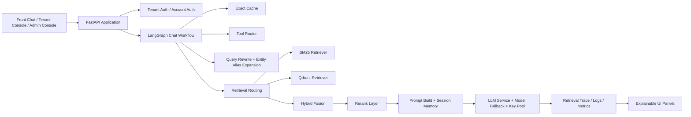

# Enterprise Knowledge Copilot

Enterprise Knowledge Copilot is a **multi-tenant enterprise RAG platform** for building private knowledge assistants with **retrieval orchestration, session memory, model routing, observability, and guardrails**.

It is not just a chat wrapper around an LLM.  
This project implements the full application layer around enterprise AI:

- multi-tenant isolation
- tenant-specific prompt / model / retrieval config
- hybrid retrieval with BM25 + vector search + rerank
- retrieval routing, retry, and query rewrite
- chat sessions and short-term memory
- cache, logs, trace explanation, and evaluations
- admin console, tenant console, and front chat workspace

## Why This Project Is Interesting

Most RAG demos stop at “upload docs -> ask question”.

This project goes further:

- **RAG orchestration**: retrieval is dynamically routed by query profile instead of using one fixed search path
- **Explainability**: every answer can expose `knowledge_hits`, `retrieval_trace`, rerank state, timing, and hit tiers
- **Multi-tenant runtime**: each tenant owns its own prompt, retrieval config, theme, model config, users, and knowledge space
- **Operational AI**: includes observability, guardrail events, evaluation runs, scheduler, and request audit logs
- **Fallback design**: supports cache hit, retrieval retry, tool-first routing, model fallback, and key-pool rotation

## Core Capabilities

### 1. Multi-Tenant Enterprise AI Runtime

- isolated tenant knowledge spaces
- tenant admin accounts and tenant member accounts
- tenant-level `app_config`, `system_prompt`, `model_config`, `retrieval_config`, `tool_config`
- tenant branding, theme colors, and custom recommended questions

### 2. Retrieval Stack

- **BM25 sparse retrieval**
- **Qdrant vector retrieval**
- **Hybrid retrieval**
- **Rerank layer**
- **Query rewrite**
- **Retrieval retry stages**
- **Query intent / answer strategy routing**
- **Entity alias expansion**

### 3. Explainable RAG

For each answer, the system can persist and render:

- hit files
- hit tiers
- recall score / rerank score / final score
- retrieval backend
- retrieval route
- retrieval attempts
- model used
- phase timings
- cache hit state

### 4. Chat Application Layer

- streaming SSE answers
- session-based chat history
- short-term memory scoped by session
- exact-match cache for same-tenant same-question reuse
- queueing and response status updates

### 5. Operations & Governance

- input/output guardrails
- request logs
- chat audit logs
- retrieval trace logs
- evaluation runs
- crawler scheduler
- model config and API key pool management

## Architecture



## Retrieval Pipeline

```text
question
  -> guardrails
  -> cache lookup
  -> query rewrite
  -> entity alias expansion
  -> query profile classification
  -> answer strategy routing
  -> tool-first / knowledge-rag / general-fallback / realtime-fallback
  -> retrieval backend selection
  -> bm25 / qdrant / hybrid
  -> rerank
  -> prompt build
  -> llm generation
  -> cache write + chat log + retrieval trace
```

## Query Routing Examples

| Query Type | Example | Strategy | Retrieval |
|---|---|---|---|
| Identifier / system lookup | `中信戴卡 EDI 系统是什么` | `knowledge_rag` | `bm25` first |
| Process / policy | `合同审批规范是什么` | `knowledge_rag` | `hybrid` |
| Time / tool question | `今天周几了` | `tool_first` | tool shortcut |
| Realtime info | `最近有哪些网络维护公告` | `realtime_fallback` | retrieval first, then fallback |
| General explanation | `RAG 是什么` | `general_fallback` | retrieval + model fallback |

## Tech Stack

### Backend

- Python
- FastAPI
- LangGraph
- SQLite
- Qdrant
- NumPy / scikit-learn
- Jieba

### Frontend

- HTML
- TailwindCSS
- Vanilla JavaScript
- SSE streaming UI

### AI / Retrieval

- BM25
- Vector retrieval
- Hybrid fusion
- Rerank
- Prompt routing
- Session memory

## Project Structure

```text
backend/
  main.py                    # FastAPI entry
  chat_workflow.py           # LangGraph-based chat orchestration
  rag.py                     # RAG engine and runtime construction
  retrievers.py              # BM25 / Qdrant / Hybrid retrievers
  rerankers.py               # local + remote rerank backends
  retrieval_orchestration.py # query routing / rewrite / retry / judge
  document_processing.py     # document parsing and semantic chunking
  llm_service.py             # model routing / fallback / streaming
  database.py                # auth, logs, sessions, chat storage
  tools.py                   # weather / datetime / email tool router

frontend/
  admin_v2.html              # platform admin console
  tenant_v2.html             # tenant admin console
  index_v2.html              # front chat UI
  login_v2.html              # login page

data/
  app_config.json
  retrieval_config.json
  tenants/

knowledge/
  permanent/
  seasonal/
  hotfix/
```

## Engineering Highlights

### Retrieval Orchestration

- query profile classification: `identifier_lookup / keyword_exact / faq_semantic / process_policy`
- entity alias expansion for enterprise names, system names, and abbreviations
- retry strategy with staged backend switching
- retrieval judge with confidence bands

### Explainability

- unified `knowledge_hits`
- unified `retrieval_trace`
- retrieval summary UI
- hit file cards and evidence cards
- request-log to chat-log trace linking

### Enterprise Readiness

- tenant isolation
- prompt customization
- local / remote retrieval configuration
- local / remote rerank configuration
- model base URL / primary / fallback config
- API key pool rotation

### Productization

- admin UI + tenant UI + front chat UI
- no-cache HTML delivery to avoid stale templates
- branded tenant login experiences
- session list like mainstream chat products

## Local Development

### 1. Install dependencies

```bash
pip install -r requirements.txt
```

### 2. Configure keys

Use one of:

- `.env`
- `config/api_keys.txt`

Example values are provided in:

- `.env.example`
- `config/api_keys.txt.example`

### 3. Run the app

```bash
python -m uvicorn backend.main:app --host 0.0.0.0 --port 6090
```

Open:

- Platform admin: `http://127.0.0.1:6090/admin`
- Tenant console: `http://127.0.0.1:6090/tenant`
- Front chat: `http://127.0.0.1:6090/chat`

## Security Notes

- real secrets are excluded from git
- runtime DB and vector store are excluded from git
- tenant private knowledge data is excluded from git
- sample config is committed, runtime config stays local

## What This Repo Demonstrates

This repo is best understood as an **enterprise AI application engineering project**, not only an LLM demo.

It demonstrates:

- how to build a multi-tenant RAG product
- how to orchestrate retrieval instead of hardcoding one search path
- how to make RAG observable and debuggable
- how to bridge admin tooling, tenant ops, and chat UX in one system

---

If you are building enterprise knowledge assistants, private AI copilots, or multi-tenant RAG systems, this repo can serve as a practical reference implementation.
