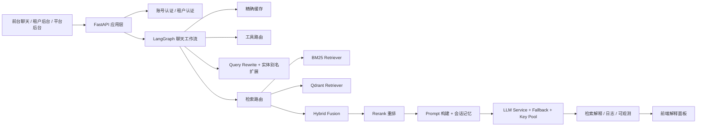

# Enterprise Knowledge Copilot

Enterprise Knowledge Copilot 是一个面向企业场景的 **多租户 RAG 知识助手平台**。  
它不只是“套了一个大模型聊天框”，而是把企业 AI 应用真正落到了完整工程链路上：

- 多租户隔离
- 租户级 Prompt / 模型 / 检索配置
- BM25 + 向量检索 + 混合检索 + Rerank
- Query Rewrite / Query Routing / Retry / Judge
- 会话历史与短期记忆
- 缓存、日志、检索解释、评测、调度
- 平台后台、租户后台、前台聊天三端联动

## 项目亮点

大部分 RAG Demo 只做到：

`上传文档 -> 提问 -> 返回答案`

这个项目往前走了一大步，重点做了企业级 AI 产品真正需要的部分：

- **检索编排**：不是固定一条检索链，而是会根据问题画像动态选择检索路径
- **可解释性**：每次回答都能回传 `knowledge_hits`、`retrieval_trace`、Rerank 状态、命中层级、耗时信息
- **多租户运行时**：每个租户拥有独立的知识空间、Prompt、检索配置、模型配置、主题配置和账号体系
- **可运营**：有审计日志、检索解释、评测实验、采集调度、安全护栏、缓存命中等完整后台能力
- **可降级与兜底**：支持缓存命中、工具优先、检索重试、模型 fallback、Key 池轮换

## 核心能力

### 1. 多租户企业 AI 运行时

- 租户知识库隔离
- 租户管理员与成员账号体系
- 租户级 `app_config / system_prompt / model_config / retrieval_config / tool_config`
- 独立品牌配置、主题色、欢迎语、推荐问题

### 2. 检索能力栈

- **BM25 稀疏检索**
- **Qdrant 向量检索**
- **Hybrid 混合检索**
- **Rerank 重排**
- **Query Rewrite**
- **分级重试策略**
- **问题意图 / 回答策略路由**
- **实体词 / 别名扩召回**

### 3. 可解释 RAG

每一次回答都可以落库并展示：

- 命中文件
- 命中层级
- 召回分 / 重排分 / 综合分
- 检索后端
- 检索路径
- 检索尝试次数
- 实际使用模型
- 各阶段耗时
- 缓存命中状态

### 4. 聊天应用层

- SSE 流式输出
- 会话列表与会话内历史消息
- 基于 `session_id` 的短期记忆
- 同租户同问题精确缓存
- 排队状态与生成状态可视化

### 5. 运维与治理

- 输入 / 输出安全护栏
- 请求日志
- 对话审计日志
- 检索解释日志
- 评测实验
- 采集调度器
- 模型配置与 Key 池治理

## 系统架构



## 检索链路

```text
question
  -> guardrails
  -> cache lookup
  -> query rewrite
  -> entity alias expansion
  -> query profile classification
  -> answer strategy routing
  -> tool-first / knowledge-rag / general-fallback / realtime-fallback
  -> retrieval backend selection
  -> bm25 / qdrant / hybrid
  -> rerank
  -> prompt build
  -> llm generation
  -> cache write + chat log + retrieval trace
```

## 问题路由示例

| 问题类型 | 示例 | 回答策略 | 检索方式 |
|---|---|---|---|
| 流程 / 制度问题 | `合同审批规范是什么` | `knowledge_rag` | `hybrid` |
| 时间 / 工具类问题 | `今天周几了` | `tool_first` | 工具直达 |
| 实时类问题 | `最近有哪些网络维护公告` | `realtime_fallback` | 检索优先，低命中再 fallback |
| 通用解释问题 | `RAG 是什么` | `general_fallback` | 检索 + 模型兜底 |

## 技术栈

### 后端

- Python
- FastAPI
- LangGraph
- SQLite
- Qdrant
- NumPy / scikit-learn
- Jieba

### 前端

- HTML
- TailwindCSS
- Vanilla JavaScript
- SSE 流式渲染

### AI / 检索

- BM25
- Vector Retrieval
- Hybrid Fusion
- Rerank
- Prompt Routing
- Session Memory

## 项目结构

```text
backend/
  main.py                    # FastAPI 入口
  chat_workflow.py           # LangGraph 聊天编排
  rag.py                     # RAG 引擎与运行时构建
  retrievers.py              # BM25 / Qdrant / Hybrid 检索器
  rerankers.py               # 本地与远程重排器
  retrieval_orchestration.py # query 路由 / 改写 / 重试 / judge
  document_processing.py     # 文档解析与语义切片
  llm_service.py             # 模型路由 / fallback / 流式生成
  database.py                # 账号、日志、会话、聊天存储
  tools.py                   # weather / datetime / email 工具路由

frontend/
  admin_v2.html              # 平台后台
  tenant_v2.html             # 租户后台
  index_v2.html              # 前台聊天页
  login_v2.html              # 登录页

data/
  app_config.json
  retrieval_config.json
  tenants/

knowledge/
  permanent/
  seasonal/
  hotfix/
```

## 工程化亮点

### 检索编排

- 问题画像分类：`identifier_lookup / keyword_exact / faq_semantic / process_policy`
- 企业名、系统名、缩写、别名扩召回
- 分阶段检索重试
- 检索质量判断与置信度分层

### 可解释性

- 统一 `knowledge_hits`
- 统一 `retrieval_trace`
- 检索摘要卡
- 命中文件卡
- 证据片段卡
- 请求日志与对话日志联动追踪

### 企业级能力

- 多租户隔离
- Prompt 定制
- 本地 / 远程检索配置切换
- 本地 / 远程 Rerank 切换
- 模型主备配置
- Key 池轮换

### 产品化能力

- 平台后台 + 租户后台 + 前台聊天三端
- no-cache 模板下发，避免前端吃旧页面
- 企业登录页与品牌化主题能力
- 类 Chat 产品的会话列表与多轮记忆

## 本地启动

### 1. 安装依赖

```bash
pip install -r requirements.txt
```

### 2. 配置密钥

任选一种方式：

- `.env`
- `config/api_keys.txt`

示例文件：

- `.env.example`
- `config/api_keys.txt.example`

### 3. 启动服务

```bash
python -m uvicorn backend.main:app --host 0.0.0.0 --port 6090
```

访问入口：

- 平台后台：`http://127.0.0.1:6090/admin`
- 租户后台：`http://127.0.0.1:6090/tenant`
- 前台聊天：`http://127.0.0.1:6090/chat`

## 安全说明

- 真实密钥不会提交到仓库
- 本地数据库与向量库不会提交到仓库
- 租户私有知识数据不会提交到仓库
- 仓库保留的是可公开的代码与示例配置

## 这个仓库体现了什么

这个项目更适合被理解为一个 **企业 AI 应用工程项目**，而不只是一个大模型 Demo。

它体现了：

- 如何构建多租户 RAG 产品
- 如何把检索从“固定搜索”升级为“动态编排”
- 如何让 RAG 具备可解释、可排障、可运营能力
- 如何把后台运维、租户配置和前台聊天体验整合到一套系统里

---

如果你正在做企业知识助手、私有 AI Copilot、或者多租户 RAG 平台，这个仓库可以作为一个相对完整的工程参考。
